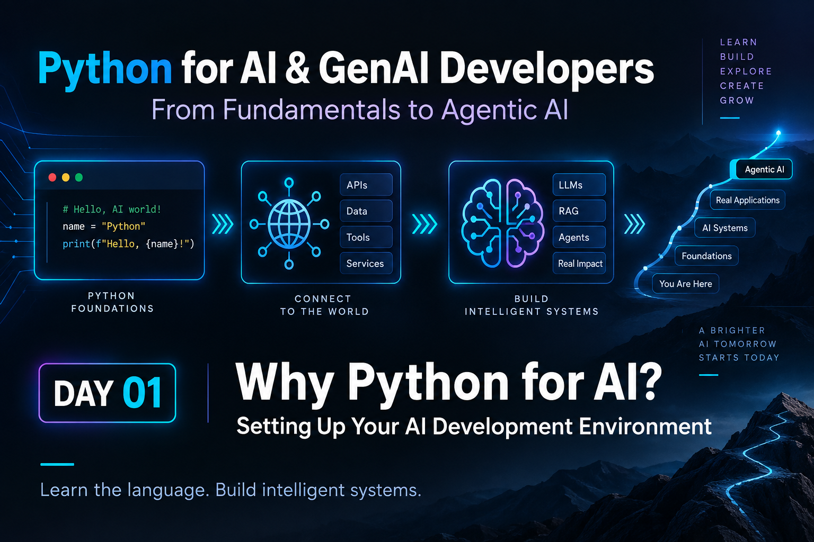

# Python for AI & GenAI Developers — Day 01
## Why Python for AI? Setting Up Your AI Development Environment

**Series:** From Fundamentals to Agentic AI  
**Level:** Absolute beginner  
**Estimated learning time:** 20–30 minutes

---



## The Journey Starts Here

AI applications can look intimidating from the outside.

Large language models, embeddings, vector databases, RAG, agents, MCP, multi-agent systems — there are many terms, tools, and frameworks.

But underneath many of these systems, you will repeatedly find one programming language:

**Python.**

During this series, we are not learning Python simply for the sake of learning syntax.

We are learning Python because it will become the language we use to:

- call AI models,
- process documents,
- work with APIs,
- create embeddings,
- search vector stores,
- build RAG applications,
- create tools for AI agents,
- work with agent frameworks,
- and eventually build production-ready AI systems.

Today we start with the foundation: setting up a clean Python development environment and running our first program.

---

# What You'll Learn

By the end of Day 01, you will understand:

1. Why Python is so widely used in AI development.
2. What a Python development environment is.
3. Why we will use `uv` throughout this series.
4. How to install and manage Python with `uv`.
5. How to create your first Python project.
6. How to run your first Python program.
7. How today's simple setup connects to the AI systems we will build later.

---

# Why Python for AI Development?

Python is not the only language capable of building AI applications.

But it has become one of the most important languages in modern AI engineering because several useful characteristics come together in one place.

## 1. Python is readable

Consider this:

```python
topic = "Generative AI"

print(f"I am learning {topic}")
```

Even if you have never written Python before, you can probably guess what the code does.

That readability matters when you are learning complex AI concepts.

We want your attention on the AI problem — not on unnecessary language complexity.

---

## 2. Python has a huge AI ecosystem

Python is widely supported across:

- machine learning,
- data processing,
- LLM APIs,
- embeddings,
- vector search,
- RAG,
- agent frameworks,
- model evaluation,
- automation,
- notebooks,
- cloud AI platforms.

Later in this series we will work with increasingly advanced AI libraries and SDKs.

The Python foundation we build now will continue to be useful throughout that journey.

---

## 3. Python works extremely well with APIs

Most modern AI applications communicate with models and services through APIs.

Conceptually, the flow often looks like:

```text
Python Application
       ↓
      API
       ↓
   AI Service
       ↓
    Response
```

You will eventually write Python code that sends prompts, documents, tool definitions, structured data, and requests to AI services.

That is why APIs appear very early in our roadmap.

---

## 4. Python works well with data

AI systems constantly work with data:

- text,
- JSON,
- documents,
- CSV files,
- vectors,
- model responses,
- tool outputs,
- logs.

Python gives us a simple way to manipulate these forms of data.

---

# Where Are We Going?

Our complete journey will eventually look approximately like this:

```text
Python
   ↓
Data
   ↓
APIs
   ↓
AI Fundamentals
   ↓
LLMs
   ↓
Prompt Engineering
   ↓
Embeddings
   ↓
Vector Search
   ↓
RAG
   ↓
Tool Calling
   ↓
Agents
   ↓
Agent Frameworks
   ↓
MCP
   ↓
Multi-Agent Systems
   ↓
Production AI
```

Today we are standing at the very first box.

That first box matters.

If your Python foundation is weak, advanced AI frameworks can feel like magic.

If your Python foundation is strong, you can understand what those frameworks are actually doing.

---

# Our Development Tooling: `uv`

Throughout this series, we will use **`uv`** as our Python project and package-management tool.

We will use it consistently for:

- installing/managing Python,
- creating projects,
- managing dependencies,
- synchronizing environments,
- and running Python code.

This gives us one modern workflow from Day 01 through Day 80.

---

# Step 1 — Install `uv`

## Windows

Open **PowerShell** and run:

```powershell
powershell -ExecutionPolicy ByPass -c "irm https://astral.sh/uv/install.ps1 | iex"
```

After installation, close and reopen the terminal if necessary.

Verify:

```powershell
uv --version
```

You should see the installed `uv` version.

---

## macOS / Linux

Run:

```bash
curl -LsSf https://astral.sh/uv/install.sh | sh
```

Then verify:

```bash
uv --version
```

---

# Step 2 — Install Python with `uv`

One useful feature of `uv` is that it can manage Python versions for us.

Run:

```bash
uv python install
```

To view available and installed Python versions:

```bash
uv python list
```

For this series, we will keep the project on a modern Python 3.x version.

---

# Step 3 — Create the Day 01 Project

Create a workspace for the series and move into it.

For example:

```bash
mkdir python-ai-genai
cd python-ai-genai
```

Now initialize the first project:

```bash
uv init day01_environment_setup
```

Move into the project:

```bash
cd day01_environment_setup
```

Depending on the current `uv` project template, you will see project files including a `pyproject.toml` and a starter Python file.

The exact starter layout can evolve between tool versions, but the important idea remains the same:

> `uv init` gives us a structured Python project instead of an unorganized collection of files.

---

# Step 4 — Create Our First Program

Create or replace `main.py` with:

```python
series_name = "Python for AI & GenAI Developers"
current_day = 1
learning_goal = "Build intelligent AI applications with Python"

print(series_name)
print(f"Day {current_day}")
print(learning_goal)
```

Do not worry about understanding every part of this program yet.

Over the next few posts we will learn exactly what variables, strings, numbers, and formatted strings mean.

For today, observe that our program stores information and prints it.

---

# Step 5 — Run the Program

From the project directory, run:

```bash
uv run python main.py
```

Expected output:

```text
Python for AI & GenAI Developers
Day 1
Build intelligent AI applications with Python
```

You have now:

- installed your development tooling,
- installed Python,
- created a structured Python project,
- written Python code,
- and executed it.

That is a small result technically.

But it establishes the workflow we will reuse for much bigger applications.

---

# Step 6 — Open the Project in VS Code

If Visual Studio Code is installed and its command-line launcher is available, run:

```bash
code .
```

Otherwise, open VS Code manually and select the `day01_environment_setup` folder.

Recommended editor capabilities for this series include:

- Python language support,
- integrated terminal,
- syntax highlighting,
- notebook support later in the series,
- debugging.

We will keep the editor setup lightweight and add tools only when we actually need them.

---

# What Is `pyproject.toml`?

You may notice a file named:

```text
pyproject.toml
```

Do not edit it heavily today.

For now, think of it as:

> the project's Python configuration and dependency manifest.

Later, when we start adding libraries, `uv` will keep our project configuration and lock information organized.

For example, when a future lesson needs a library, we will use commands such as:

```bash
uv add some-package
```

And when another learner clones the project, the environment can be synchronized with:

```bash
uv sync
```

We will explore this properly in a later lesson.

---

# Why Are We Starting With Setup Instead of AI?

Because AI development still depends on software engineering fundamentals.

Consider a future RAG application:

```text
User Question
      ↓
Python Application
      ↓
Embedding / Retrieval
      ↓
Relevant Documents
      ↓
LLM
      ↓
Grounded Answer
```

Or a future agent:

```text
User Request
      ↓
Python Agent
      ↓
Select Tool
      ↓
Call API / Search / Retrieve Data
      ↓
Observe Result
      ↓
Generate Answer
```

Python sits in the middle of the workflow.

Today we are creating the environment in which those systems will eventually live.

---

# AI Connection

Today's program:

```python
series_name = "Python for AI & GenAI Developers"
```

looks extremely simple.

Later, we will write variables that hold things such as:

```python
user_prompt = "Explain vector search in simple language"
```

Then:

```python
model_name = "some-ai-model"
```

And later:

```python
retrieved_documents = [...]
```

Eventually, the same basic language constructs will participate in code that calls AI models, searches knowledge bases, and orchestrates agents.

The complexity grows.

The foundations remain recognizable.

---

# Try It Yourself

Modify `main.py`.

Create three pieces of information:

- your name,
- what you want to learn,
- what you eventually want to build.

For example:

```python
name = "Alex"
learning_topic = "Python and Generative AI"
goal = "Build an AI research assistant"

print(name)
print(learning_topic)
print(goal)
```

Run it again:

```bash
uv run python main.py
```

---

# Mini Challenge

Without copying the exact example, try to make the output look like:

```text
Hello! I am Alex.
I am learning Python and Generative AI.
My goal is to build an AI research assistant.
```

Do not worry if you do not know the cleanest solution.

Experiment.

Tomorrow we will start learning the Python concepts that make this code easier to understand.

---

# Common Beginner Mistakes

## 1. Running the command from the wrong folder

If Python cannot find `main.py`, check the current directory.

Your terminal should be inside:

```text
day01_environment_setup
```

---

## 2. `uv` command not found

If installation succeeded but the terminal cannot find `uv`, restart your terminal.

If necessary, follow the PATH guidance from the official `uv` installation documentation.

---

## 3. Editing a file but forgetting to save

Save `main.py` before running it.

---

## 4. Typing Python code directly into the shell

Commands such as:

```bash
uv run python main.py
```

belong in the terminal.

Python code such as:

```python
print("Hello")
```

belongs inside `main.py` or an interactive Python session.

---

# What We Built Today

Today you:

- understood why Python is important for AI development,
- installed `uv`,
- used `uv` to manage Python,
- created a structured project,
- wrote your first Python program,
- ran the program,
- and saw how this simple environment will grow into an AI development workspace.

---

# Tomorrow — Day 02

Today our program stored information such as the series name, day number, and learning goal.

But we used those values without really understanding how Python stores them or how Python knows whether something is text, a number, or another type of information.

**Tomorrow we will learn variables, values, and Python data types — the building blocks behind almost every piece of data an AI application handles.**

---

# Source Notes

For installation and current `uv` commands, refer to Astral's official `uv` documentation:

- https://docs.astral.sh/uv/getting-started/installation/
- https://docs.astral.sh/uv/guides/install-python/
- https://docs.astral.sh/uv/getting-started/features/
