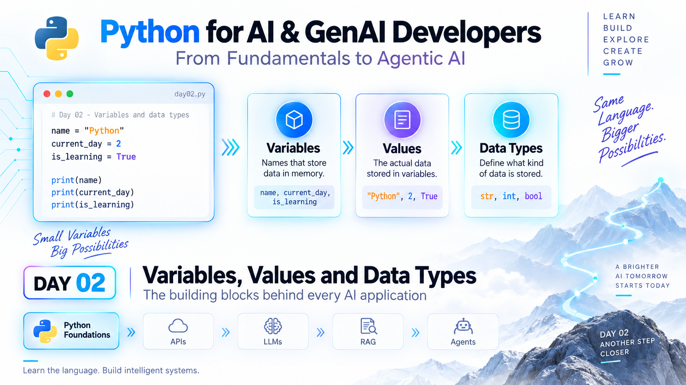

# Python for AI & GenAI Developers — Day 02
## Variables, Values and Data Types

**Series:** From Fundamentals to Agentic AI  
**Level:** Absolute beginner  
**Estimated learning time:** 20–30 minutes

---



# The Journey Continues

Yesterday, we created our first Python project and ran our first program.

Today we will start understanding what that program was actually doing.

Consider this code:

```python
series_name = "Python for AI & GenAI Developers"
current_day = 2
is_learning = True
```

At first glance, these may look like simple assignments.

But they introduce three ideas that appear everywhere in software and AI development:

- variables,
- values,
- data types.

These are the building blocks used to store and manage information inside a Python application.

Later, the same ideas will hold:

- prompts,
- model names,
- temperatures,
- token limits,
- retrieved documents,
- tool results,
- agent state,
- configuration values.

So today we are learning something very basic — but also something that every future AI application will depend on.

---

# What You'll Learn

By the end of Day 02, you will understand:

1. What a variable is.
2. What a value is.
3. What a data type is.
4. The basic Python data types: `str`, `int`, `float`, and `bool`.
5. How to inspect a variable's type.
6. How variables appear in AI-oriented Python code.
7. How to create and modify your own variables.

---

# 1. What Is a Variable?

A variable is a name that refers to a value.

For example:

```python
name = "Python"
```

Here:

```text
name      → variable
"Python"  → value
```

You can think of a variable as a labeled container.

```text
┌───────────────┐
│ name          │
│ "Python"      │
└───────────────┘
```

The label is `name`.

The information stored is `"Python"`.

---

# 2. Why Do We Need Variables?

Imagine writing this:

```python
print("Python for AI & GenAI Developers")
print("Python for AI & GenAI Developers")
print("Python for AI & GenAI Developers")
```

That works.

But repeating the same value everywhere makes code harder to maintain.

Instead:

```python
series_name = "Python for AI & GenAI Developers"

print(series_name)
print(series_name)
print(series_name)
```

Now the value is stored once.

If the series name changes, we update it in only one place.

This is one of the main reasons variables are useful.

---

# 3. What Is a Value?

A value is the actual piece of data stored or referenced by a variable.

Examples:

```python
topic = "Generative AI"
day = 2
temperature = 0.7
is_active = True
```

The values are:

```text
"Generative AI"
2
0.7
True
```

Each value has a type.

That brings us to the next concept.

---

# 4. What Is a Data Type?

A data type describes what kind of information a value represents.

Python needs to understand whether a value is:

- text,
- a whole number,
- a decimal number,
- a true/false value,
- or something more complex.

For today, we will focus on four basic data types.

---

# 5. Strings — `str`

Strings represent text.

Example:

```python
topic = "Generative AI"
```

The value:

```python
"Generative AI"
```

is a string.

Strings are usually surrounded by quotes.

You can use:

```python
"Python"
```

or:

```python
'Python'
```

Both are valid.

---

# Why Strings Matter for AI

AI applications work heavily with text.

For example:

```python
user_prompt = "Explain vector search in simple terms"
```

Later, we may send this string to an AI model.

Another example:

```python
system_message = "You are a helpful AI assistant."
```

Prompts, instructions, messages, document text, and model responses are commonly represented as strings.

---

# 6. Integers — `int`

Integers are whole numbers.

Examples:

```python
current_day = 2
max_retries = 3
document_count = 10
```

These values have no decimal part.

---

# Why Integers Matter for AI

AI applications frequently use integer values.

For example:

```python
max_tokens = 500
```

or:

```python
top_results = 5
```

You may use integers to represent:

- token limits,
- retry counts,
- number of documents,
- number of search results,
- batch sizes.

---

# 7. Floating-Point Numbers — `float`

A float represents a decimal number.

Example:

```python
temperature = 0.7
```

Other examples:

```python
score = 0.92
threshold = 0.80
```

---

# Why Floats Matter for AI

Many AI settings and evaluation scores use decimal numbers.

For example:

```python
temperature = 0.7
```

Later, this may control how varied or deterministic an AI model's output is.

Similarity scores may also look like:

```python
similarity_score = 0.91
```

So floats appear often in AI applications.

---

# 8. Booleans — `bool`

A Boolean represents one of two values:

```python
True
False
```

Example:

```python
is_learning = True
```

Another example:

```python
enable_streaming = False
```

Notice that Python uses capital letters:

```python
True
False
```

Not:

```python
true
false
```

---

# Why Booleans Matter for AI

Booleans are useful when an application needs to turn behavior on or off.

For example:

```python
use_rag = True
enable_streaming = False
save_history = True
```

These are often called flags.

---

# 9. A Complete Example

Create a file named:

```text
main.py
```

and add:

```python
series_name = "Python for AI & GenAI Developers"
current_day = 2
temperature = 0.7
is_learning = True

print(series_name)
print(current_day)
print(temperature)
print(is_learning)
```

Run it with:

```bash
uv run python main.py
```

Expected output:

```text
Python for AI & GenAI Developers
2
0.7
True
```

---

# 10. Checking a Variable's Type

Python provides a built-in function called:

```python
type()
```

We can use it to inspect a value.

Example:

```python
series_name = "Python for AI & GenAI Developers"
current_day = 2
temperature = 0.7
is_learning = True

print(type(series_name))
print(type(current_day))
print(type(temperature))
print(type(is_learning))
```

Expected output:

```text
<class 'str'>
<class 'int'>
<class 'float'>
<class 'bool'>
```

That tells us:

```text
series_name  → str
current_day  → int
temperature  → float
is_learning  → bool
```

---

# 11. Python Uses Dynamic Typing

In Python, you do not normally need to declare a variable type in advance.

You can simply write:

```python
topic = "AI"
```

Python determines that the value is a string.

Similarly:

```python
day = 2
```

Python understands that `day` currently refers to an integer.

This is called dynamic typing.

We will discuss type hints later in the series, when we begin writing larger and more maintainable programs.

---

# 12. Variable Naming Rules

Variable names should be meaningful.

Good:

```python
user_prompt = "Explain embeddings"
max_tokens = 500
enable_streaming = True
```

Less useful:

```python
x = "Explain embeddings"
a = 500
b = True
```

Use descriptive names whenever possible.

---

# 13. Python Naming Convention

In Python, variable names usually follow:

```text
snake_case
```

Examples:

```python
user_name
model_name
max_tokens
document_count
similarity_score
```

Words are lowercase and separated with underscores.

This is the naming style we will use throughout the series.

---

# 14. Variables Can Change

A variable can be assigned a new value.

Example:

```python
current_day = 2

print(current_day)

current_day = 3

print(current_day)
```

Output:

```text
2
3
```

The variable name stays the same.

The value changes.

---

# 15. A Simple AI-Oriented Example

Let's make today's code look slightly more like something we may eventually see in an AI application.

```python
model_name = "my-ai-model"
user_prompt = "Explain Python variables"
max_tokens = 300
temperature = 0.7
enable_streaming = True

print("Model:", model_name)
print("Prompt:", user_prompt)
print("Max tokens:", max_tokens)
print("Temperature:", temperature)
print("Streaming enabled:", enable_streaming)
```

Run:

```bash
uv run python main.py
```

We are not calling an AI model yet.

But notice how familiar AI concepts can already be represented using basic Python variables.

---

# 16. Understanding the Code

Let's examine:

```python
model_name = "my-ai-model"
```

`model_name` is the variable.

`"my-ai-model"` is the value.

The type is:

```python
str
```

---

Now:

```python
max_tokens = 300
```

The variable is:

```text
max_tokens
```

The value is:

```text
300
```

The type is:

```python
int
```

---

And:

```python
enable_streaming = True
```

The value is a Boolean:

```python
bool
```

These same basic concepts will appear repeatedly later.

---

# 17. AI Connection

Today's lesson may seem simple.

But consider a future AI request configuration:

```python
model_name = "my-ai-model"
user_prompt = "Summarize this document"
temperature = 0.2
max_tokens = 500
use_rag = True
```

Every line depends on today's concepts.

Later, these variables may feed into:

- an API request,
- a model SDK,
- a RAG pipeline,
- a tool call,
- an agent configuration.

So when we eventually build advanced AI systems, Python variables will still be everywhere.

---

# Try It Yourself

Create these variables:

```python
name = "Your Name"
learning_topic = "Generative AI"
days_completed = 2
confidence_score = 0.6
is_committed = True
```

Print all five values.

Then print the type of each variable.

Example:

```python
print(type(name))
```

---

# Mini Challenge

Create a small learner profile.

Use these kinds of data:

```text
Name
Current day
Learning topic
Hours per week
Confidence score
Is learning AI?
```

Choose the correct data type for each one.

Then produce output similar to:

```text
Learner: Alex
Day: 2
Topic: Generative AI
Hours per week: 6
Confidence: 0.7
Learning AI: True
```

Try to write it without copying the previous example exactly.

---

# Common Beginner Mistakes

## 1. Forgetting quotes around text

Wrong:

```python
topic = Generative AI
```

Correct:

```python
topic = "Generative AI"
```

Text values need quotes.

---

## 2. Using lowercase Boolean values

Wrong:

```python
is_active = true
```

Correct:

```python
is_active = True
```

---

## 3. Using spaces in variable names

Wrong:

```python
model name = "AI Model"
```

Correct:

```python
model_name = "AI Model"
```

---

## 4. Starting a variable name with a number

Wrong:

```python
2day_topic = "Variables"
```

Better:

```python
day2_topic = "Variables"
```

---

## 5. Using unclear variable names

Avoid:

```python
x = 500
```

Prefer:

```python
max_tokens = 500
```

Readable code becomes increasingly important as our projects become larger.

---

# What We Built Today

Today you learned:

- what a variable is,
- what a value is,
- what a data type is,
- how to work with strings,
- integers,
- floats,
- Booleans,
- how to inspect types with `type()`,
- how basic Python variables appear in AI-oriented code.

You also created data that begins to resemble the configuration of a future AI application.

---

# Tomorrow — Day 03

Today we learned how Python stores different types of information.

One of those types — the string — is particularly important for AI because prompts, instructions, document text, and model responses are all text.

**Tomorrow we will go deeper into strings and learn how Python works with the kind of data every GenAI application depends on.**

---

# Key Takeaway

```text
Variable → gives data a name
Value    → the actual data
Type     → describes what kind of data it is
```

And in AI applications:

```text
Prompt          → str
Max Tokens      → int
Temperature     → float
Streaming Flag  → bool
```

Small concepts.

Big future impact.

---

# Series Principle

> **Same Python. Bigger possibilities.**

Learn the language.  
Understand the concepts.  
Build real systems.  
Progress from fundamentals to agentic AI.
