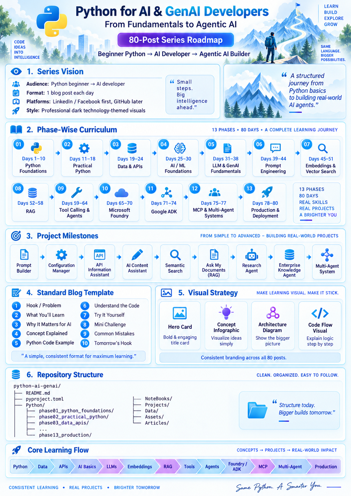

# Python for AI & GenAI Developers
## From Fundamentals to Agentic AI
# [An Intiative by TechLienzo](https://www.youtube.com/@TechLienzo-ue7dn)
Click the link here to know more 👉[Visit our website](https://www.youtube.com/@TechLienzo-ue7dn)


> **80 Days. One progressive journey. From Python beginner to AI / GenAI developer.**

This repository supports the learning series **Python for AI & GenAI Developers — From Fundamentals to Agentic AI**.

The goal is not to teach Python as an isolated programming language.

The goal is to use Python as the foundation for progressively learning and building:

- APIs
- AI and ML fundamentals
- Large Language Models
- Prompt Engineering
- Embeddings
- Vector Search
- RAG
- Tool Calling
- AI Agents
- Microsoft Agentic Framework
- Google ADK
- MCP
- Multi-Agent Systems
- Microsoft Foundry
- Gemini Enterprise Agent Platform
- Production AI systems

---

# Who Is This Series For?

This series is designed for:

- complete Python beginners,
- developers moving into AI / GenAI,
- software engineers who want a structured AI learning path,
- architects who want to understand how modern AI systems are built,
- learners who want to move beyond prompts and into real AI application development.

No prior Python knowledge is required at the beginning.

---

# Learning Philosophy

The series follows one important rule:

> **Understand the concept first. Then use the SDK. Then the framework. Then the managed platform.**

Where possible, we progress like this:

```text
Concept
   ↓
Plain Python
   ↓
SDK / API
   ↓
Agent Framework
   ↓
Managed Platform
```

This helps avoid framework dependency and makes advanced AI systems easier to understand.

---

# Technology Direction

## Python Package Management

This series uses:

```bash
uv
```

throughout the entire journey.

Typical commands include:

```bash
uv init
uv add package-name
uv sync
uv run python main.py
```

## Agent Frameworks

The advanced agent-development phases will focus on:

- **Microsoft Agentic Framework**
- **Google ADK**

## Enterprise AI Platforms

The platform-oriented sections will focus on:

- **Microsoft Foundry**
- **Gemini Enterprise Agent Platform** *(historically known as Vertex AI)*

The early and intermediate phases remain as vendor-neutral as practical.

---

# 80-Day Learning Roadmap

| Phase | Days | Focus |
|---|---:|---|
| 01 | 1–10 | Python Foundations |
| 02 | 11–18 | Practical Python |
| 03 | 19–24 | Data, JSON and APIs |
| 04 | 25–30 | AI and ML Foundations |
| 05 | 31–38 | LLM and GenAI Fundamentals |
| 06 | 39–44 | Prompt Engineering |
| 07 | 45–51 | Embeddings and Vector Search |
| 08 | 52–58 | RAG |
| 09 | 59–64 | Tool Calling and Agents |
| 10 | 65–70 | Microsoft Foundry |
| 11 | 71–74 | Microsoft Agentic Framework and Google ADK |
| 12 | 75–77 | MCP and Multi-Agent Systems |
| 13 | 78–80 | Production AI |

---

# Progress Tracker

## Phase 01 — Python Foundations

| Day | Topic | Article | Code | Status |
|---:|---|---|---|---|
| 01 | Why Python for AI? Setting Up Your AI Development Environment | [Read Article](Python_AI_GenAI_Day01/Articles/day01_why_python_for_ai.md) | [View Code](Python_AI_GenAI_Day01/Python/day01_environment_setup/main.py/) | ✅ |
| 02 | Variables, Values and Data Types | Coming Soon | Coming Soon | ⏳ |
| 03 | Working with Strings — Essential for AI Prompts and Text | Coming Soon | Coming Soon | ⏳ |
| 04 | Numbers, Booleans and Python Operators | Coming Soon | Coming Soon | ⏳ |
| 05 | Making Decisions with `if`, `elif` and `else` | Coming Soon | Coming Soon | ⏳ |
| 06 | Loops: Automating Repetitive Work with `for` and `while` | Coming Soon | Coming Soon | ⏳ |
| 07 | Python Lists — Your First Real Data Structure | Coming Soon | Coming Soon | ⏳ |
| 08 | Dictionaries — The Data Structure Every AI Developer Needs | Coming Soon | Coming Soon | ⏳ |
| 09 | Tuples, Sets and When to Use Them | Coming Soon | Coming Soon | ⏳ |
| 10 | Functions — Turning Python Code into Reusable Logic | Coming Soon | Coming Soon | ⏳ |

---

# Day 01

## Why Python for AI? Setting Up Your AI Development Environment

Day 01 establishes the development environment we will reuse throughout the series.

You will learn:

- why Python is widely used in AI development,
- how to install and use `uv`,
- how to manage Python with `uv`,
- how to create a structured Python project,
- how to run your first program,
- how today's simple setup connects to future AI applications.

### Read the Tutorial

➡️ [Day 01 — Why Python for AI?](Python_AI_GenAI_Day01/Articles/day01_why_python_for_ai.md)

### Run the Code

```bash
cd Python/phase01_python_foundations/day01_environment_setup
uv run python main.py
```

### Try the Challenge

```bash
uv run python challenge.py
```

---

# Project Milestones

| Stage | Project |
|---|---|
| Python Foundations | Prompt Builder CLI |
| Practical Python | AI Configuration Manager |
| APIs | API-Powered Information Assistant |
| LLMs / Prompting | AI Content Assistant |
| Embeddings | Semantic Search Engine |
| RAG | Ask My Documents |
| Tools / Agents | Research Assistant Agent |
| Microsoft Foundry | Enterprise Knowledge Agent |
| Agent Frameworks | Microsoft Agentic Framework + Google ADK workflows |
| MCP | MCP-Enabled Agent System |
| Multi-Agent | Research → Analysis → Writer System |
| Production | Production-Ready Agentic AI Application |

---

# Repository Structure

```text
python-ai-genai/
│
├── README.md
├── SERIES_MASTER_GUIDE.md
├── pyproject.toml
├── uv.lock
├── .env.example
├── .gitignore
│
├── Articles/
│   ├── phase01/
│   ├── phase02/
│   └── ...
│
├── Python/
│   ├── phase01_python_foundations/
│   ├── phase02_practical_python/
│   ├── phase03_data_apis/
│   └── ...
│
├── NoteBooks/
│   ├── embeddings/
│   ├── rag/
│   ├── vector_search/
│   └── experiments/
│
├── Projects/
│   ├── prompt_builder/
│   ├── ai_content_assistant/
│   ├── semantic_search/
│   ├── ask_my_documents/
│   ├── research_agent/
│   └── multi_agent_system/
│
├── Data/
│   └── samples/
│
└── Assets/
    ├── hero/
    ├── diagrams/
    ├── infographics/
    └── screenshots/
```

---

# How Each Day Is Structured

Most daily tutorials follow this pattern:

1. Hook / real problem
2. What you'll learn
3. Why it matters for AI developers
4. Concept explained simply
5. Python example
6. Understand the code
7. AI connection
8. Try it yourself
9. Mini challenge
10. Common beginner mistakes
11. What we built today
12. Tomorrow's hook

---

# The Journey Ahead

```text
Python
  ↓
Data
  ↓
APIs
  ↓
AI Foundations
  ↓
LLMs
  ↓
Prompt Engineering
  ↓
Embeddings
  ↓
Vector Search
  ↓
RAG
  ↓
Tools
  ↓
Agents
  ↓
Agent Frameworks
  ↓
MCP
  ↓
Multi-Agent Systems
  ↓
Production AI
```

By the end of the series, the learner should not simply know Python syntax.

They should understand how Python participates in real AI systems.

---

# Series Principle

> **Same Python. Bigger possibilities.**

Learn the language.  
Understand the concepts.  
Build real systems.  
Progress from fundamentals to agentic AI.

---

# Current Status

**Day 01:** Complete ✅

**Next:**  
**Day 02 — Variables, Values and Python Data Types**
